# Lakehouse with Delta Lake

The purpose of this repository is to run a local spark-based lakehouse for test purposes.


The components used are:

* Spark 3.5.3 master and worker, with Delta Lake 3.2.0.
* Hive Metastore 3.1.3 backed by PostgreSQL 16.
* MinIO as S3-compatible object storage (`warehouse` and `raw` buckets).
* Prometheus scraping Spark JVM metrics and Grafana with a provisioned dashboard.
* Airflow scheduling the catalog IO Spark app hourly, with StatsD metrics exported to Prometheus.
* Trino querying Delta tables through the Hive Metastore, with a Grafana Trino dashboard.
* Jupyter/PySpark with the same Delta, S3A, and Hive configuration.

## Pre-requisites
Docker service running and `docker compose` installed.

To run the example Jupyter notebooks, install `vscode` and install `Jupyter` extension

## Start the environment

```
scripts/./start.sh
```

## Service URLs

| Service | URL | Credentials |
| --- | --- | --- |
| Spark master UI | http://localhost:8080 | - |
| Spark worker UI | http://localhost:8081 | - |
| Hive Metastore | `thrift://localhost:9083` | PostgreSQL-backed |
| MinIO API / console | http://localhost:9000 / http://localhost:9001 | `minioadmin` / `minioadmin` |
| Jupyter | http://localhost:8888 | token `local` |
| Prometheus | http://localhost:9090 | - |
| Grafana | http://localhost:3000 | `admin` / `admin` |
| Trino | http://localhost:8082 | - |
| Airflow | http://localhost:8088 | `airflow` / `airflow`|

**Note:** Inside containers (e.g. sparks apps / notebooks), use the following:

|Service|	Address|
|---|---|
|Spark Master|	spark://spark-master:7077|
|Hive Metastore|	hive-metastore:9083|
|MinIO|	minio:9000|

**Note:** host applications (i.e. your computer) must use `localhost` instead. 

## Architecture and data flow

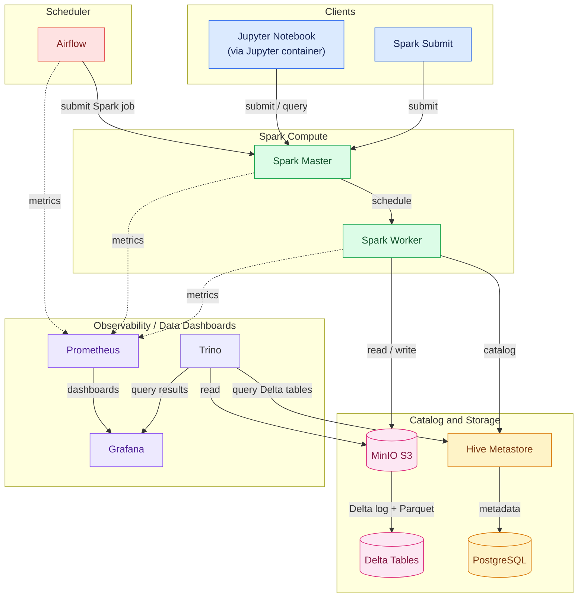

## Locked versions

The following versions are the tested compatibility set for the catalog and
Delta notebooks. 

Docker images built from `Dockerfile` entries inherit the
version shown in the `FROM` image; the Spark and Jupyter images therefore
share Spark 3.5.3 and Python 3.11.10.

| Component | Version | Source or usage |
| --- | --- | --- |
| Spark master/worker | 3.5.3 | `quay.io/jupyter/pyspark-notebook:spark-3.5.3` |
| Jupyter/PySpark | 3.5.3 / Python 3.11.10 | Same base image; notebook kernel metadata |
| Scala | 2.12 | Spark 3.5.3 distribution and `delta-spark_2.12` artifacts |
| Delta Lake | 3.2.0 | `delta-spark==3.2.0`; `io.delta:delta-spark_2.12:3.2.0` |
| Hive Metastore | 3.1.3 | `apache/hive:3.1.3`; Spark-compatible Thrift API |
| Hadoop AWS (Spark/Jupyter) | 3.3.4 | `org.apache.hadoop:hadoop-aws:3.3.4` |
| Hadoop AWS (Hive) | 3.1.0 | Bundled with the Hive 3.1.3 image |
| AWS SDK (Spark/Jupyter) | 1.12.262 | Downloaded from Maven Central during image build |
| AWS SDK (Hive) | 1.11.271 | Downloaded from Maven Central during image build |
| WildFly OpenSSL | 1.0.7.Final | Added to Spark, Jupyter, and Hive images |
| PostgreSQL JDBC | 42.7.4 | Added to the Hive image |
| PostgreSQL | 16-alpine | `postgres:16-alpine` |
| Prometheus | 2.53.5 | `prom/prometheus:v2.53.5` |
| Grafana | 11.4.0 | `grafana/grafana:11.4.0` |
| Trino | 476 | `trinodb/trino:476` |
| MinIO server/client | `latest` | `minio/minio:latest` and `minio/mc:latest` |

The smaller Java dependencies listed above are vendored in
[`jars/`](/home/user/src/lakehouse_local/jars) and copied into the images during
the build. The AWS SDK bundles are downloaded from Maven Central during the
image build because GitHub rejects those large artifacts.

Their SHA-256 checksums are
recorded in [`jars/SHA256SUMS`](/home/user/src/lakehouse_local/jars/SHA256SUMS).

If a vendored JAR is updated, replace its checksum and version entry, then
rebuild the images. If an AWS SDK version is updated, update its pinned Maven
Central URL in each dependent Dockerfile.

MinIO is the only runtime dependency intentionally left on a moving `latest`
tag because the project uses the matching server/client pair. For reproducible
deployments, replace both tags with a tested digest or matching release tag.


**Do not mix** the Spark/Jupyter Hadoop AWS jars with the Hive image's Hadoop AWS
and AWS SDK versions; each classpath is pinned as shown above.

----
## Spark Apps
Example spark apps:
- spark-apps/catalog_io.py (uses hive catalog)
- spark-apps/delta_io.py (direct access mini-io `s3a://`)

The catalog examples:

```
./scripts/run_catalog_app.sh write
./scripts/run_catalog_app.sh read
./scripts/run_catalog_app.sh append
./scripts/run_catalog_app.sh schema
./scripts/run_catalog_app.sh history
./scripts/run_catalog_app.sh time-travel
```

`schema` uses Delta's `mergeSchema` option, `history` reads the transaction
log with `DESCRIBE HISTORY`, and `time-travel` reads a prior snapshot with
`versionAsOf`.

## Spark notebooks
Several example notebooks are stored in `notebooks/` folder.

Do the following to run a notebook:

- open the notebook
- select the locally running jupyter server.
Enter http://localhost:8888 and use the token/password `local`. 
- run the cells from top to bottom. 

The notebooks do the following:
- creates a Spark session
- writes and reads a Delta table in MinIO
- appends rows
- demonstrates schema evolution
- displays transaction history
- reads an earlier table version with time travel
- Stop the Spark session

## Airflow

Airflow runs the `catalog_io_hourly` DAG every hour. The DAG submits the
existing `spark-apps/catalog_io.py append` operation to the Spark cluster, so
each successful run adds one record to the catalog Delta table.


Airflow metadata is stored in the PostgreSQL `airflow` database. Airflow
metrics are emitted over StatsD, translated by the StatsD exporter,
and scraped by Prometheus. The provisioned **Airflow overview** dashboard is
available in Grafana under the **Spark** folder.

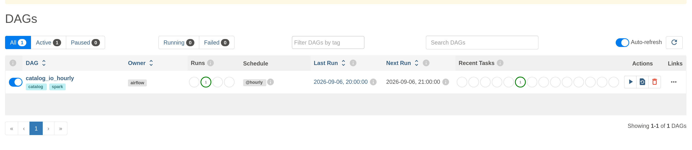


## Notes on locked down versions
### Configuration

Spark workers and Jupyter use the pinned Hadoop AWS 3.3.4 connector.

Hive Metastore runs Hive 3.1.3, which is compatible with Spark 3.5 and uses matching Hadoop AWS/AWS SDK versions.

The Metastore also needs the S3A connector because it validates S3A database locations on the server side.

### MinIO / S3A setup

The delta tables are stored here:
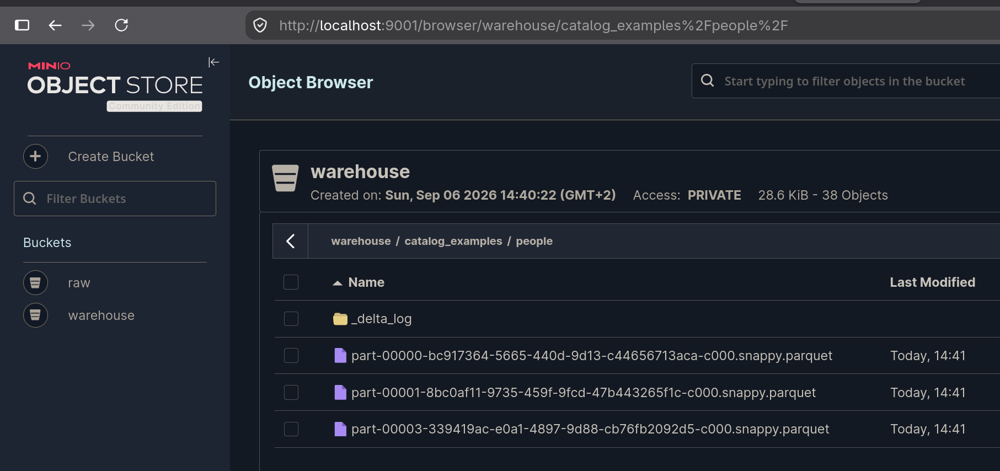

The Metastore receives the MinIO endpoint, credentials, and S3A configuration through `SERVICE_OPTS`.

It explicitly uses:
        Hadoop's SimpleAWSCredentialsProvider
        MinIO's us-east-1 region

- The Metastore starts after minio-init, ensuring the bucket already exists.
- The Hive image includes the required S3A settings in core-site.xml.
- MinIO credentials are taken from the Metastore container's environment variables.


### Result

This configuration ensures org.apache.hadoop.fs.s3a.S3AFileSystem is available on the classpaths of:

- Jupyter / notebook driver
- Spark workers
- Hive Metastore


## Using a catalog

The catalog notebook uses the existing Hive Metastore as Spark's external
catalog.

The catalog is metadata, not a replacement for object storage. Keep the
warehouse/database location stable, and use the same metastore and S3A
configuration for every Spark client that reads or writes these tables. The
catalog notebook demonstrates registration, append, schema evolution,
`DESCRIBE HISTORY`, and time travel without direct path-based table access.

### Catalog access control

Catalog access control is not setup. This can be done by setting up authentication on the hive server.

https://hive.apache.org/docs/latest/admin/setting-up-hiveserver2/


## Spark worker

Spark clients submit work to the master, which schedules it on the worker.
The worker reads and writes Delta transaction logs and Parquet data in MinIO,
while the Hive Metastore stores catalog metadata in PostgreSQL. Prometheus
scrapes the Spark web UIs and Grafana queries those metrics.

### Runnning spark apps

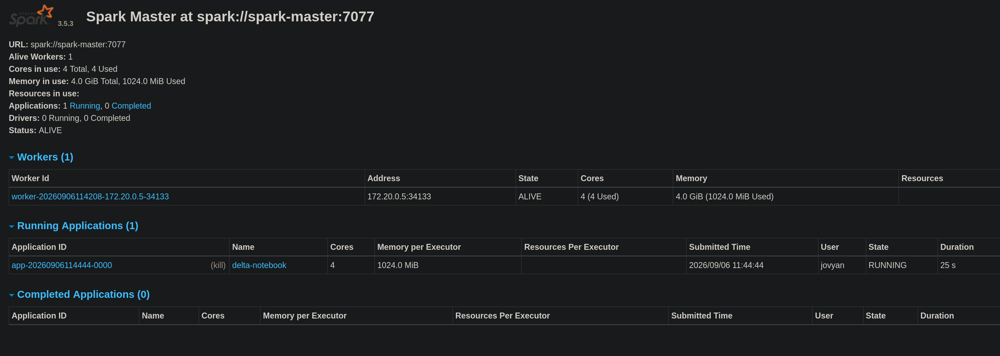

### Completed spark apps - spark.stop()

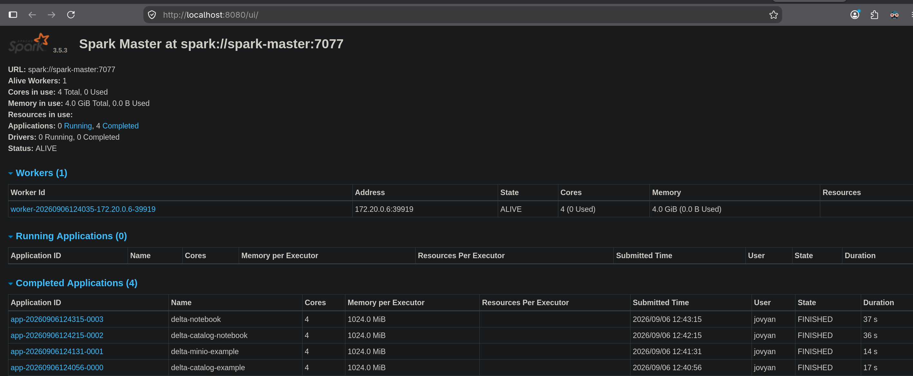

## Stop and troubleshooting

```
docker compose ps
docker compose logs hive-metastore spark-worker
docker compose down
```

Use `docker compose down -v` to delete all volume data as well (full refresh)

## Data Dashboard
Graphana can be used to query the hive catalogs by using TRINO.

An example dashboard is provisioned (run the `./scripts/run_catalog_app.sh`)

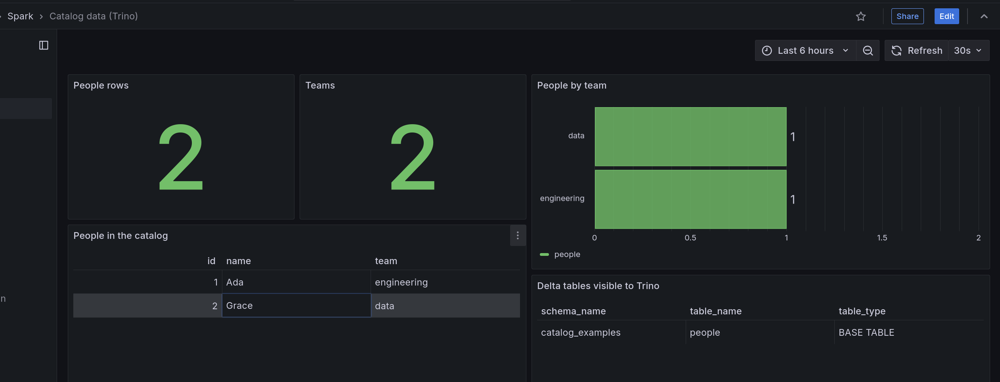


## Observability

Two dashboards are pre-built and deployed:
- cluster overview dashboard
- catalogs dashboard

Open http://localhost:3000 and sign in with `admin` / `admin`. 

## Cluster overview dashboard
The
provisioned **Spark cluster overview** dashboard includes:

* **Spark services up**: number of healthy Spark Prometheus targets.
* **Scrape availability**: whether the Spark master and worker metrics
  endpoints are reachable.
* **JVM heap used** and **JVM heap max**: memory usage and configured maximum
  for Spark JVM processes.
* **JVM committed memory**: committed heap memory for each Spark JVM.
* **Spark JVM CPU seconds**: JVM process CPU time rate over the selected time
  range.
* **Spark active stages** and **Spark executor task throughput**: application
  execution activity when Spark application metrics are present.
* **MinIO S3 requests** and **MinIO bucket usage**: object-store activity and
  storage consumed by the lakehouse.


The Spark worker metrics are scraped by prometheus, and visualised by grafana.

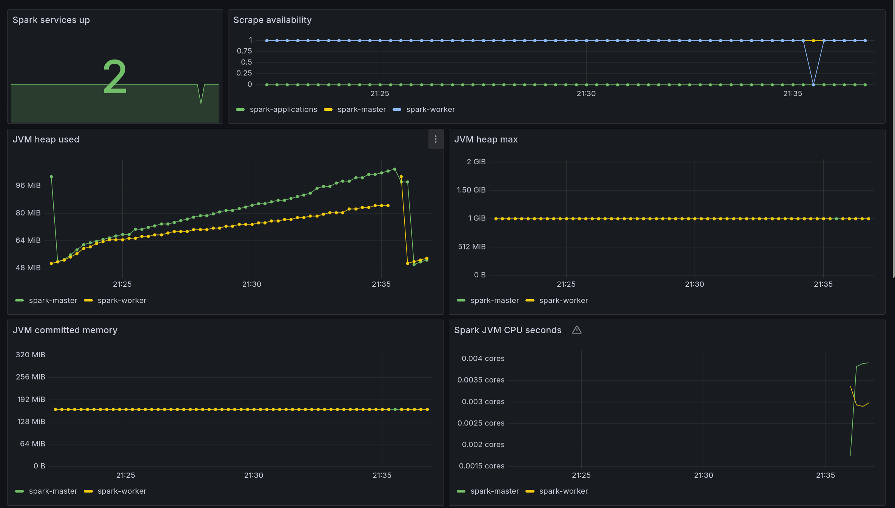
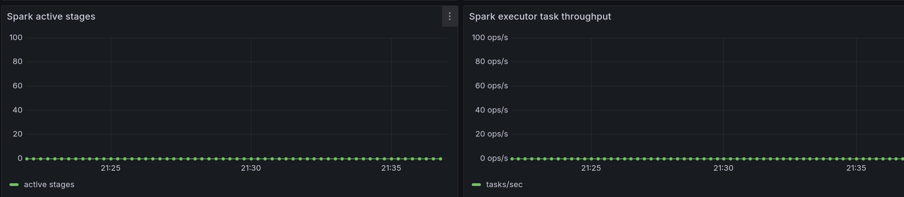

Additionally, the MiniIo metrics is also scraped.
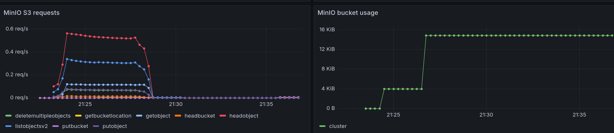


### Catalogs dashboard

The **Spark catalogs** dashboard is also provisioned. It queries the
read-only Hive Metastore PostgreSQL datasource and shows registered databases,
existing tables, and database/table grants. 

This is an example of querying
Spark's Hive catalog from Grafana.

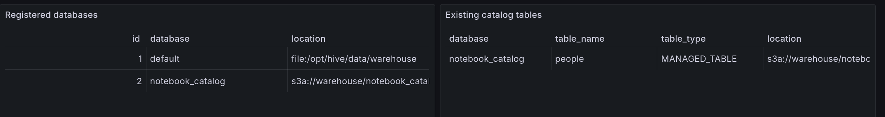

### Catalog data dashboard

The provisioned **Catalog data (Trino)** dashboard queries the Delta tables
created by `./scripts/run_catalog_app.sh write` through Trino. It shows row and
team counts, the people records, and the Delta tables visible in the catalog.
Run the example first, then open Grafana and select the dashboard under the
**Spark** folder.

### Airflow dashboard

Airflow task dashboards in grafana

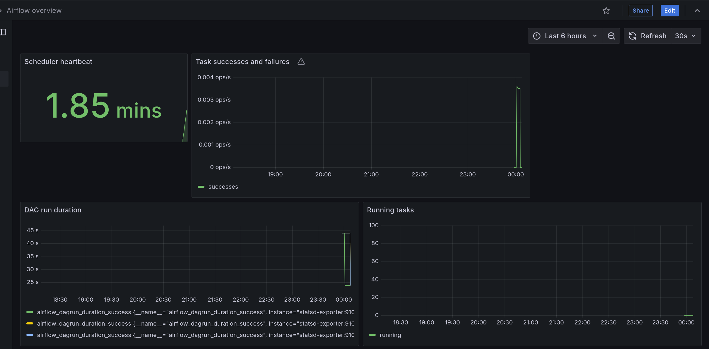
