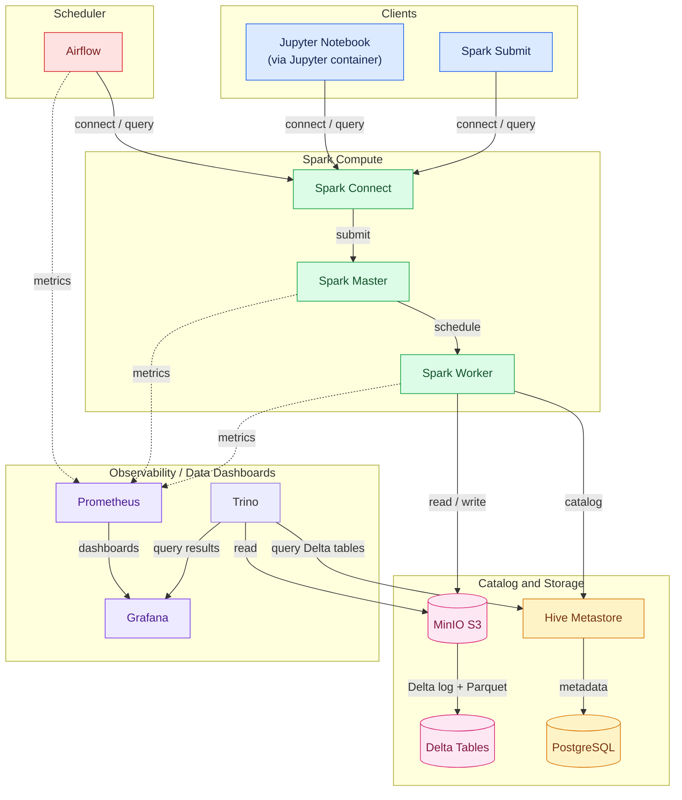
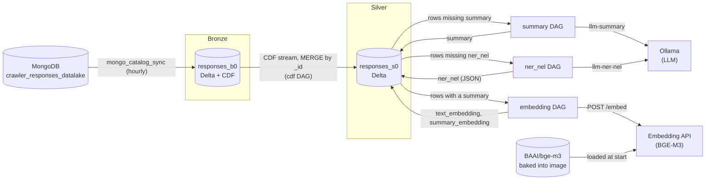

# Lakehouse with Delta Lake

The purpose of this repository is to run a local spark-based lakehouse for test purposes.


The components used are:

* Spark 3.5.3 master and workers, with Delta Lake 3.2.0 and a Spark Connect endpoint.
* Hive Metastore 3.1.3 backed by PostgreSQL 16.
* MinIO as S3-compatible object storage (`warehouse` and `raw` buckets).
* Prometheus scraping Spark JVM metrics and Grafana with a provisioned dashboard.
* Airflow scheduling the catalog IO Spark app hourly, with StatsD metrics exported to Prometheus.
* Airflow scheduling configurable MongoDB-to-Delta-catalog sync jobs (multiple
  independently scheduled instances driven by a YAML config).
* Trino querying Delta tables through the Hive Metastore, with a Grafana Trino dashboard.
* Jupyter/PySpark with the same Delta, S3A, and Hive configuration.

## Pre-requisites
Docker service running and `docker compose` installed.

To run the example Jupyter notebooks, install `vscode` and install `Jupyter` extension

## Start the environment

```bash
scripts/./start.sh
```

## Service URLs

| Service | URL | Credentials |
| --- | --- | --- |
| Spark master UI | http://localhost:8080 | - |
| Spark worker UI | http://localhost:8081 | - |
| Spark Connect | `sc://localhost:15002` | - |
| Hive Metastore | `thrift://localhost:9083` | PostgreSQL-backed |
| MinIO API / console | http://localhost:9000 / http://localhost:9001 | `minioadmin` / `minioadmin` |
| Jupyter | http://localhost:8888 | token `local` |
| Prometheus | http://localhost:9090 | - |
| Grafana | http://localhost:3001 | `admin` / `admin` |
| Trino | http://localhost:8082 | - |
| Airflow | http://localhost:8088 | `airflow` / `airflow`|

**Note:** Inside containers (e.g. sparks apps / notebooks), use the following:

|Service|	Address|
|---|---|
|Spark Master|	spark://spark-master:7077|
|Spark Connect|	sc://spark-connect:15002|
|Hive Metastore|	hive-metastore:9083|
|MinIO|	minio:9000|

**Note:** host applications (i.e. your computer) must use `localhost` instead. 

## Spark Connect

The `spark-connect` service exposes Spark Connect on port 15002 and submits
work to the existing Spark standalone cluster. Connect from an application on
the host with the matching client version:

```bash
pip install "pyspark[connect]==3.5.3"
```

```python
from pyspark.sql import SparkSession

spark = SparkSession.builder.remote("sc://localhost:15002").getOrCreate()
```

Note: use spark connect instead of a jupyter server for speed (i.e. `sc://localhost:15002`)

From the bundled Jupyter container, use
`sc://spark-connect:15002` instead. Its image includes the Spark Connect
client dependencies. Spark Connect sessions use the server's configured Delta,
Hive Metastore, and MinIO integrations; configure session-level options on the
Connect `SparkSession` when an application needs additional settings.

## Architecture and data flow



## Locked versions

The following versions are the tested compatibility set for the catalog and
Delta notebooks. 

Docker images built from `Dockerfile` entries inherit the
version shown in the `FROM` image; the Spark and Jupyter images therefore
share Spark 3.5.3 and Python 3.11.10.

| Component | Version | Source or usage |
| --- | --- | --- |
| Spark master/worker/Connect server | 3.5.3 | `quay.io/jupyter/pyspark-notebook:spark-3.5.3` |
| Jupyter/PySpark | 3.5.3 / Python 3.11.10 | Same base image; notebook kernel metadata |
| Scala | 2.12 | Spark 3.5.3 distribution and `delta-spark_2.12` artifacts |
| Delta Lake | 3.2.0 | `delta-spark==3.2.0`; `io.delta:delta-spark_2.12:3.2.0` |
| Hive Metastore | 3.1.3 | `apache/hive:3.1.3`; Spark-compatible Thrift API |
| Hadoop AWS (Spark/Jupyter) | 3.3.4 | `org.apache.hadoop:hadoop-aws:3.3.4` |
| Hadoop AWS (Hive) | 3.1.0 | Bundled with the Hive 3.1.3 image |
| AWS SDK (Spark/Jupyter) | 1.12.262 | Downloaded from Maven Central during image build |
| AWS SDK (Hive) | 1.11.271 | Downloaded from Maven Central during image build |
| WildFly OpenSSL | 1.0.7.Final | Added to Spark, Jupyter, and Hive images |
| PostgreSQL JDBC | 42.7.4 | Added to the Hive image |
| MongoDB Spark Connector | 10.4.1 | `org.mongodb.spark:mongo-spark-connector_2.12:10.4.1`; downloaded from Maven Central during the Spark/Airflow image build |
| MongoDB Java driver (sync/core/bson) | 5.1.1 | Transitive dependencies of the Spark connector; downloaded from Maven Central during the Spark/Airflow image build |
| pymongo | 4.9.2 | Added to the Spark and Airflow images for the delete-after-sync step |
| PostgreSQL | 16-alpine | `postgres:16-alpine` |
| Prometheus | 2.53.5 | `prom/prometheus:v2.53.5` |
| Grafana | 11.4.0 | `grafana/grafana:11.4.0` |
| Trino | 476 | `trinodb/trino:476` |
| MinIO server/client | `latest` | `minio/minio:latest` and `minio/mc:latest` |

The smaller Java dependencies listed above are vendored in
[`jars/`](/home/user/src/lakehouse_local/jars) and copied into the images during
the build. The AWS SDK bundles are downloaded from Maven Central during the
image build because GitHub rejects those large artifacts.

Their SHA-256 checksums are
recorded in [`jars/SHA256SUMS`](/home/user/src/lakehouse_local/jars/SHA256SUMS).

If a vendored JAR is updated, replace its checksum and version entry, then
rebuild the images. If an AWS SDK version is updated, update its pinned Maven
Central URL in each dependent Dockerfile.

MinIO is the only runtime dependency intentionally left on a moving `latest`
tag because the project uses the matching server/client pair. For reproducible
deployments, replace both tags with a tested digest or matching release tag.


**Do not mix** the Spark/Jupyter Hadoop AWS jars with the Hive image's Hadoop AWS
and AWS SDK versions; each classpath is pinned as shown above.

----
## Spark Apps
Example spark apps:
- spark-apps/catalog_io.py (uses the Hive catalog through Spark Connect)
- spark-apps/delta_io.py (direct access to MinIO `s3a://` through Spark Connect)
- spark-apps/mongo_catalog_sync.py (reads a MongoDB collection, appends it to
  the Delta catalog through Spark Connect, then deletes the synced documents; see
  [Airflow](#mongodb-to-catalog-sync-jobs) below for scheduling)

All applications create a remote `SparkSession` with
`SparkSession.builder.remote(...)`; they do not start a local Spark driver or
submit directly to the standalone master. The shell scripts and Airflow DAGs
run the Python clients against `sc://spark-connect:15002`. Delta, Hive
Metastore, S3A, and MongoDB connector configuration is owned by the
`spark-connect` service, so changes to the client applications do not need to
duplicate server-side Spark configuration.

The catalog examples:

```
./scripts/run_catalog_app.sh write
./scripts/run_catalog_app.sh read
./scripts/run_catalog_app.sh append
./scripts/run_catalog_app.sh schema
./scripts/run_catalog_app.sh history
./scripts/run_catalog_app.sh time-travel
```

`schema` uses Delta's `mergeSchema` option, `history` reads the transaction
log with `DESCRIBE HISTORY`, and `time-travel` reads a prior snapshot with
`versionAsOf`.

## Spark notebooks
Several example notebooks are stored in `notebooks/` folder.

Do the following to run a notebook:

- open the notebook
- select the locally running jupyter server.
Enter http://localhost:8888 and use the token/password `local`. 
- run the cells from top to bottom. 

The notebooks do the following:
- creates a Spark session
- writes and reads a Delta table in MinIO
- appends rows
- demonstrates schema evolution
- displays transaction history
- reads an earlier table version with time travel
- Stop the Spark session

`notebooks/spark_connect_delta.ipynb` demonstrates the same Delta workflow
through the [Spark Connect](#spark-connect) endpoint (`sc://spark-connect:15002`)
instead of connecting directly to the Spark master.

## Airflow

Airflow runs the `catalog_io_hourly` DAG every hour. The DAG runs the
`spark-apps/catalog_io.py append` Spark Connect client against the
`spark-connect` service, so each successful run adds one record to the catalog
Delta table.


Airflow metadata is stored in the PostgreSQL `airflow` database. Airflow
metrics are emitted over StatsD, translated by the StatsD exporter,
and scraped by Prometheus. The provisioned **Airflow overview** dashboard is
available in Grafana under the **Spark** folder.


### MongoDB to catalog sync jobs

`spark-apps/mongo_catalog_sync.py` is a generic, configurable Spark Connect
client that:

1. Ensures the target catalog database exists (creates it if missing).
2. Reads all documents from a MongoDB collection.
3. Appends them to a Delta catalog table (creating the table on first run).
4. Deletes the exact documents that were read from MongoDB, by `_id`, so
   documents inserted after the read started are left for the next run.

`airflow/dags/mongo_catalog_sync.py` is a DAG factory that generates one
Airflow DAG per entry in
[`airflow/dags/mongo_catalog_sync_jobs.yaml`](/home/user/src/lakehouse/airflow/dags/mongo_catalog_sync_jobs.yaml).
Each entry configures one independently scheduled instance:

```yaml
jobs:
  - name: orders                 # DAG id becomes mongo_catalog_sync_orders
    mongo_database: app
    mongo_collection: orders
    catalog_database: mongo_sync
    catalog_table: orders
    schedule: "@hourly"
  - name: events
    mongo_database: app
    mongo_collection: events
    catalog_database: mongo_sync
    catalog_table: events
    schedule: "*/15 * * * *"
```

To add a new scheduled job instance, add an entry to the YAML file; no
Python changes are required. Supported keys are `name`, `mongo_database`,
`mongo_collection`, `catalog_database`, `catalog_table`, `schedule`
(a cron expression or Airflow preset such as `@hourly`), and the optional
`mongo_uri`, `batch_limit`, and `dry_run`.

This repository assumes MongoDB runs outside this Compose stack (for
example, in its own container or a managed service). To reach it from
`spark-worker` and `airflow`, either:

* attach both services to the Docker network your MongoDB instance is on
  (`docker network connect <network> lakehouse-spark-worker-1` and the
  equivalent for `lakehouse-airflow-1`, or add a `networks:` entry to
  `docker-compose.yml`), or
* set `mongo_uri` in the YAML config (or the `MONGO_URI` environment
  variable) to an address reachable from inside the containers, such as
  `mongodb://host.docker.internal:27017`.

Run via airflow:

```bash
docker compose up -d --build airflow
```

Run a single sync manually with:

```bash
./scripts/run_mongo_catalog_sync.sh \
  --mongo-uri mongodb://<host>:27017 \
  --mongo-database app \
  --mongo-collection orders \
  --catalog-database mongo_sync \
  --catalog-table orders
```

Use `--dry-run` to append to the catalog without deleting the source
documents, and `--batch-limit N` to cap how many documents are processed in
one run.


## Medallion: Bronze to Silver (responses_b0 -> responses_s0)

The crawler data follows a medallion layout in the Delta catalog:

| Layer | Table | Content | Produced by |
|-------|-------|---------|-------------|
| Bronze (b0) | `crawler.responses_b0` | Raw crawler documents, appended as-is from MongoDB (with `_synced_at`). Change Data Feed is enabled. | `mongo_catalog_sync_crawler_articles` DAG |
| Silver (s0) | `crawler.responses_s0` | Same rows, kept in sync with b0 through its Change Data Feed, **decorated** with `summary`, `ner_nel`, `text_embedding`, `summary_embedding`. | four independent `responses_s0_crawler_responses_*` DAGs |



The DAG factory `airflow/dags/responses_s0_pipeline.py` creates, per entry in
[`airflow/dags/responses_s0_pipeline.yaml`](airflow/dags/responses_s0_pipeline.yaml),
**four independent DAGs** (not chained), so each job can be scheduled, paused,
triggered and retried on its own:

| DAG | Job |
|-----|-----|
| `responses_s0_<name>_cdf` | CDF stream b0 -> s0 |
| `responses_s0_<name>_summary` | summarize `text` -> `summary` |
| `responses_s0_<name>_ner_nel` | NER/NEL -> `ner_nel` |
| `responses_s0_<name>_embedding` | embed `text` and `summary` (only rows that have a summary) |

Each job has its own `schedule`, `limit` (rows per run), `paused` flag (create the DAG
paused) and model/strategy/api settings in the YAML. Because every decorator only
selects rows still missing its value, the jobs can run in any order; rows that arrive
later are picked up by the next run. Note Airflow uses the `SequentialExecutor` here,
so only one task runs at a time across all DAGs.

### Bronze to Silver: Change Data Feed stream

`spark-apps/cdf_b0_to_s0.py` uses the `delta_streaming` package
(`lakehouse_data/`). On the first run it enables CDF on b0 (also done by
`mongo_catalog_sync.py` for new tables), creates s0 from a snapshot of b0 plus the
empty decorator columns, and starts the stream at that version. Each run then
processes the changes since the last checkpoint (`availableNow`) and `MERGE`s them
into s0 by `_id`: inserts and updates are upserted, deletes are removed. Only the
b0 columns are written, so decorator values already in s0 are preserved.
Metrics are emitted to StatsD like the other streaming pipelines.

### Decorators

All decorators are run by `spark-apps/decorate_s0.py --decorator <name>`. Each run
selects up to `limit` s0 rows that still lack the value, computes it, and merges it
back by `_id`. They are therefore idempotent, and rows that fail (for example an
LLM error) are retried on the next run. They run in the `/opt/decorators-venv`
virtualenv inside the Airflow image so the LLM client dependencies do not clash
with Airflow.

1. **summary** - uses [`llm-summary`](https://pypi.org/project/llm-summary/)
   (`SummaryInferenceProvider`) to summarize `text` and stores the result in the
   string column `summary`. `summary.model` and `summary.strategy` are configurable.
2. **ner_nel** - uses [`llm-ner-nel`](https://pypi.org/project/llm-ner-nel/)
   (`RelationshipInferenceProvider`) to extract entities (NER), link them (NEL) and
   their relationships from `text`. The result (topic and relationships) is stored as
   JSON in the string column `ner_nel`. `ner_nel.model` and `ner_nel.strategy` are
   configurable.
3. **embedding** - calls the separate **embedding API** (`embedding_api/`, Compose service
   `embedding-api`) to embed `text` and `summary` into the `array<float>` columns
   `text_embedding` and `summary_embedding`. Only rows that already have a
   `summary` are embedded, so run it after the summary job. `embeddings.api_url` is configurable.

### Embedding API

`embedding_api/` is a small FastAPI service wrapping `BGEM3Embedder` (BAAI/bge-m3
dense vectors, adapted from
[vespa_eval_framework](https://github.com/egerpaulj/vespa_eval_framework/blob/main/src/embeddings.py)).
The Spark/Airflow containers carry no torch/model dependencies. The model is
downloaded **once, at image build time**, into its own cached Docker layer
(`/models/BAAI--bge-m3`), so container starts never download it and need no internet
access; the first `--build` takes longer and the image is a few GB. The layer is only
rebuilt if `embedding_api/embeddings.py` or the model (`EMBEDDING_MODEL`, a build arg)
changes. If the files were ever missing, the service falls back to downloading them
at start.

```bash
docker compose up -d --build embedding-api
docker compose exec airflow curl -s http://embedding-api:8000/health
docker compose exec airflow curl -s -X POST http://embedding-api:8000/embed -H 'content-type: application/json' \
  -d '{"texts": ["hello world"]}'    # {"model": ..., "dimension": 1024, "embeddings": [[...]]}
```

`POST /embed` takes `{"texts": [...]}` (max 64 per request) and returns one vector per
text. The port is not published to the host by default.

The summarize and ner_nel decorators assume an Ollama instance is reachable at
`ollama_host` (default `http://ollama:11434`, not part of this Compose stack) with
the configured models pulled, e.g. `ollama pull gemma3:12b`. Use
`http://host.docker.internal:11434` for an Ollama running on the Docker host.

Run a decorator manually:

```bash
docker compose exec airflow bash -c "SPARK_CONNECT_URL=sc://spark-connect:15002 \
  /opt/decorators-venv/bin/python /opt/spark-apps/decorate_s0.py \
  --decorator summary --table crawler.responses_s0 --model gemma3:12b --limit 10"
```


## Notes on locked down versions
### Configuration

Spark workers and Jupyter use the pinned Hadoop AWS 3.3.4 connector.

Hive Metastore runs Hive 3.1.3, which is compatible with Spark 3.5 and uses matching Hadoop AWS/AWS SDK versions.

The Metastore also needs the S3A connector because it validates S3A database locations on the server side.

### MinIO / S3A setup

The delta tables are stored here:


The Metastore receives the MinIO endpoint, credentials, and S3A configuration through `SERVICE_OPTS`.

It explicitly uses:
        Hadoop's SimpleAWSCredentialsProvider
        MinIO's us-east-1 region

- The Metastore starts after minio-init, ensuring the bucket already exists.
- The Hive image includes the required S3A settings in core-site.xml.
- MinIO credentials are taken from the Metastore container's environment variables.


### Result

This configuration ensures org.apache.hadoop.fs.s3a.S3AFileSystem is available on the classpaths of:

- Jupyter / notebook driver
- Spark workers
- Hive Metastore


## Using a catalog

The catalog notebook uses the existing Hive Metastore as Spark's external
catalog.

The catalog is metadata, not a replacement for object storage. Keep the
warehouse/database location stable, and use the same metastore and S3A
configuration for every Spark client that reads or writes these tables. The
catalog notebook demonstrates registration, append, schema evolution,
`DESCRIBE HISTORY`, and time travel without direct path-based table access.

### Catalog access control

Catalog access control is not setup. This can be done by setting up authentication on the hive server.

https://hive.apache.org/docs/latest/admin/setting-up-hiveserver2/


## Spark worker

Spark clients submit work to the master, which schedules it on the worker.
The worker reads and writes Delta transaction logs and Parquet data in MinIO,
while the Hive Metastore stores catalog metadata in PostgreSQL. Prometheus
scrapes the Spark web UIs and Grafana queries those metrics.

### Runnning spark apps


### Completed spark apps - spark.stop()


## Stop and troubleshooting

```bash
docker compose ps
docker compose logs hive-metastore spark-worker
docker compose down
```

Use `docker compose down -v` to delete all volume data as well (full refresh)

## Data Dashboard
Graphana can be used to query the hive catalogs by using TRINO.

An example dashboard is provisioned (run the `./scripts/run_catalog_app.sh`)


## Observability

Two dashboards are pre-built and deployed:
- cluster overview dashboard
- catalogs dashboard

Open http://localhost:3000 and sign in with `admin` / `admin`. 

## Cluster overview dashboard
The
provisioned **Spark cluster overview** dashboard includes:

* **Spark services up**: number of healthy Spark Prometheus targets.
* **Scrape availability**: whether the Spark master and worker metrics
  endpoints are reachable.
* **JVM heap used** and **JVM heap max**: memory usage and configured maximum
  for Spark JVM processes.
* **JVM committed memory**: committed heap memory for each Spark JVM.
* **Spark JVM CPU seconds**: JVM process CPU time rate over the selected time
  range.
* **Spark active stages** and **Spark executor task throughput**: application
  execution activity when Spark application metrics are present.
* **MinIO S3 requests** and **MinIO bucket usage**: object-store activity and
  storage consumed by the lakehouse.


The Spark worker metrics are scraped by prometheus, and visualised by grafana.


Additionally, the MiniIo metrics is also scraped.


### Catalogs dashboard

The **Spark catalogs** dashboard is also provisioned. It queries the
read-only Hive Metastore PostgreSQL datasource and shows registered databases,
existing tables, and database/table grants. 

This is an example of querying
Spark's Hive catalog from Grafana.


### Catalog data dashboard

The provisioned **Catalog data (Trino)** dashboard queries the Delta tables
created by `./scripts/run_catalog_app.sh write` through Trino. It shows row and
team counts, the people records, and the Delta tables visible in the catalog.
Run the example first, then open Grafana and select the dashboard under the
**Spark** folder.

### Airflow dashboard

Airflow task dashboards in grafana


# Trino

To query using Trino, start the Trino client:

```bash
docker compose exec trino trino
```

See below some example queries:

- show catalogs;
```
 Catalog  
-----------
 jmx       
 lakehouse 
 memory    
 system    
 tpcds     
 tpch      
(6 rows)
```

- show schemas from lakehouse;
```
       Schema       
--------------------
 catalog_examples   
 crawler            
 default            
 information_schema 
(4 rows)

```

- show tables from lakehouse.crawler;
```
Table     
---------------
 responses_raw 
(1 row)
```

- select *  from lakehouse.crawler.responses_raw;
```
       created       | updated |                                              uri                                               |                 _id                  | entities |          >
 2026.09.20:14:39:43 | NULL    | https://www.url    | bfe607a9-e00b-431f-a19b-d103f882ceee | NULL     | https://w>
 2026.09.20:14:39:44 | NULL    | https://www.url/fruit-farmers-pesticide | abebf43f-65da-49b7-9ceb-d5d0c2580e41 | NULL     | https://w>
(2 rows)

```

