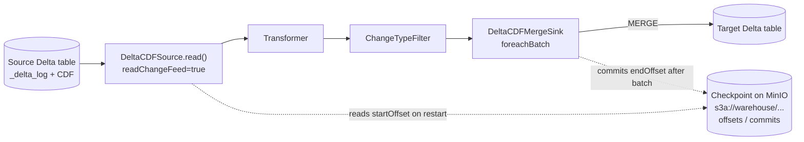
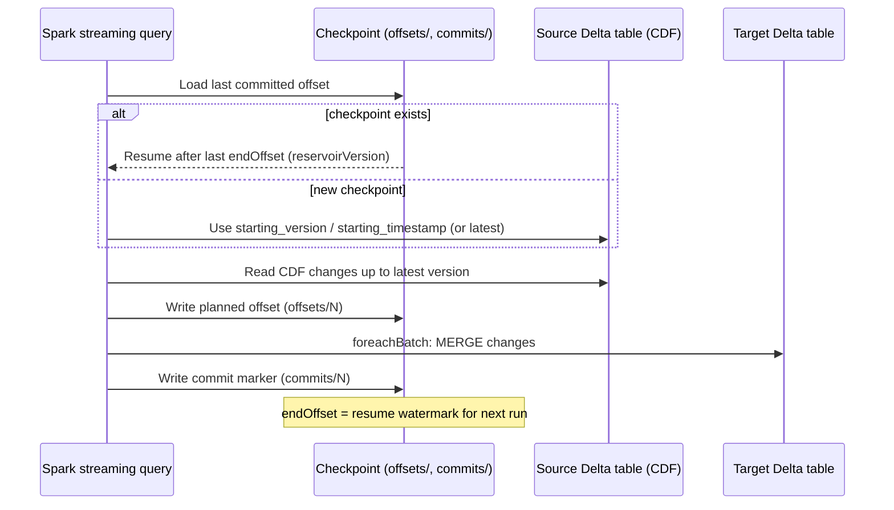

# Delta Streaming

A Python library for building Spark Structured Streaming pipelines
using Delta Lake Change Data Feed (CDF).

The library separates:

- CDF source
- transformations
- filters
- Delta MERGE sink
- pipeline orchestration

The architecture follows SOLID principles.

## Requirements

- Python 3.10+
- Apache Spark 3.5+
- Delta Lake
- A running lakehouse stack with Spark Connect, Hive Metastore, and MinIO

The Python client uses PySpark and Delta Lake. MinIO support is provided on
the Spark Connect server by Hadoop S3A (`hadoop-aws` and the matching AWS SDK),
not by a Python MinIO package. The repository's Spark image includes these JARs
and configures `s3a://` access to the `warehouse` bucket.

## Installation

Create and activate the Conda environment used by the example notebook:

```bash
conda env create -f environment.yml
conda activate local-lakehouse
````

For an existing environment, install the same dependencies with:

```bash
pip install -e .
```

In VS Code, select the `local-lakehouse` Python kernel for
`src/delta_streaming/example.ipynb`. Start the repository stack from its root
with `docker compose up -d --build`. The notebook connects to
`sc://localhost:15002`; S3A credentials and Java dependencies are configured
server-side.


## Data flow and checkpointing

The pipeline reads Delta Change Data Feed (CDF) records, applies the
transformation and change-type filter, then passes each micro-batch to the
Delta MERGE sink:

```text
Delta source table (CDF)
    -> DeltaCDFSource.read()
    -> transformer
    -> change filter
    -> DeltaCDFMergeSink.foreachBatch()
    -> MERGE into target Delta table
```

`DeltaCDFMergeSink` sets Spark's `checkpointLocation` from
`StreamConfig.checkpoint_location`. 

In the example, that is an `s3a://`
location under MinIO's `warehouse` bucket. Spark writes its streaming offset,
commit, and state metadata beneath that path; the checkpoint is separate from
the source Delta table's `_delta_log` and CDF data. The bucket must exist and
the Spark Connect server must have S3A configured. Spark creates the
checkpoint directory itself.

The latest committed source offset in this checkpoint is the resume position.
When the same source and checkpoint are used again, Spark resumes after that
offset and ignores `startingVersion` or `startingTimestamp`. Those options
choose the initial CDF position only when starting with a new checkpoint. If
neither is set for a new stream, Delta CDF starts from the latest table version
and streams subsequent changes. To replay from an earlier version, use a new
checkpoint location and set `starting_version` (or `starting_timestamp`). Keep
the checkpoint when restarting a failed stream; use a new one only for an
intentional fresh run or replay.

CDF's durable progress is a Delta source offset (table version), not a Spark
event-time watermark. The notebook prints each run's `startOffset` and
`endOffset` from `StreamingQuery.lastProgress`, labels the last completed
`endOffset` as the checkpoint resume watermark, and displays the target table
after each run. The checkpoint itself remains the durable source of truth.

### Data flow diagram



### Checkpoint lifecycle (per run)



## Spark example

```python
from pyspark.sql import SparkSession

from delta_streaming import (
    CDFStreamingPipeline,
    ChangeTypeFilter,
    DeltaCDFMergeSink,
    DeltaCDFSource,
    IdentityTransformer,
    StreamConfig,
)


spark = (
    SparkSession.builder
    .appName("customer-cdf-stream")
    .getOrCreate()
)

config = StreamConfig(
    source_table="catalog.schema.customer_source",
    target_table="catalog.schema.customer_target",
    checkpoint_location="s3a://warehouse/checkpoints/customer-cdf",
    query_name="customer-cdf",
    starting_version=0,
)


source = DeltaCDFSource(config)

sink = DeltaCDFMergeSink(
    spark=spark,
    merge_condition="""
        target.customer_id = source.customer_id
    """,
)

pipeline = CDFStreamingPipeline(
    source=source,
    transformer=IdentityTransformer(),
    change_filter=ChangeTypeFilter(
        [
            "insert",
            "update_postimage",
            "delete",
        ]
    ),
    sink=sink,
)


query = pipeline.start(
    spark=spark,
    config=config,
)

# The sink uses availableNow=True, so this run processes available changes and exits.
query.awaitTermination()

```
